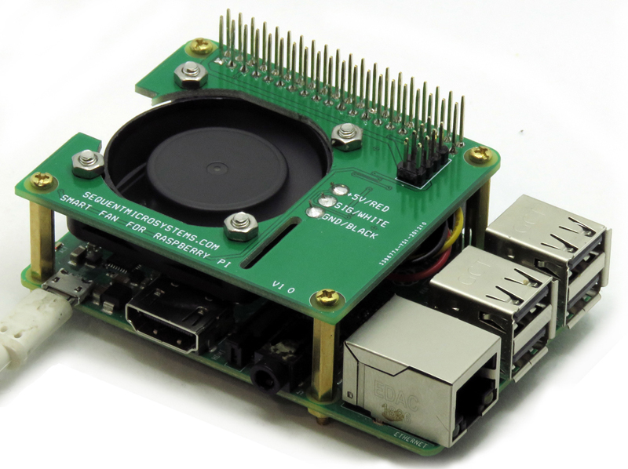

[](https://www.sequentmicrosystems.com)

# SmartFan-rpi
Command line, python library and Node-Red node for [Smart Fan](https://sequentmicrosystems.com/products/smart-fan-hat-for-raspberry-pi)



## Setup

Enable Raspberry Pi I2C communication:
```bash
~$ sudo raspi-config
```
Browse **Interfacing Options** >> **I2C** and select *Yes*

## Usage

```bash
~$ git clone https://github.com/SequentMicrosystems/SmartFan-rpi.git
~$ cd SmartFan-rpi/
~/SmartFan-rpi$ sudo make install
```

Now you can access all the functions of the relays board through the command "fan". Use -h option for help:
```bash
~$ fan -h
```

If you clone the repository any update can be made with the following commands:

```bash
~$ cd SmartFan-rpi/  
~/SmartFan-rpi$ git pull
~/SmartFan-rpi$ sudo make install
``` 

## [Python Library](https://github.com/SequentMicrosystems/SmartFan-rpi/tree/main/python)

## [Example Loop](https://github.com/SequentMicrosystems/SmartFan-rpi/tree/main/python/examples)
